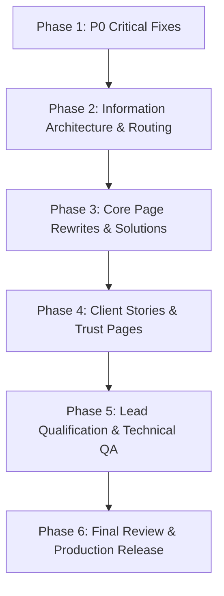

# SVaaN Global Tech — Current Website vs. Master Specification Gap Analysis & Update Plan

**Document Version:** 1.0  
**Audit Date:** October 5, 2026  
**Reference Document:** `SVaaN_Public_Website_Developer_Master_Specification.md`  
**Current Active Branch:** `pavithra`  
**Live/Staging Reference:** [https://svaan-web.vercel.app](https://svaan-web.vercel.app)

---

## 1. Executive Summary

This document performs an exhaustive, component-by-component and page-by-page comparison between the **Current Website Implementation** and the finalized **Public Website — Developer Master Specification** (`SVaaN_Public_Website_Developer_Master_Specification.md`).

### The Fundamental Shift:
* **Current State:** Presents SVaaN through a fragmented 6-capability / 13-service catalog ("Strategy & Advisory, Product & Experience, Software & Technology, AI & Automation, Engineering & Delivery, Managed Technology Services") with an agency-style "strategy + design + engineering" narrative.
* **Target Master Specification:** Positions SVaaN as a **full-lifecycle business technology partner** structured around the **Four Commercial Pillars**:
  1. **BUILD** (New products, MVPs, custom software, enterprise platforms)
  2. **MODERNIZE** (Legacy systems, architecture, cloud migration, APIs)
  3. **OPERATE** (Application support, helpdesk, production support, DevOps, cloud managed services)
  4. **EVOLVE** (AI automation, continuous optimization, product evolution, roadmaps)

The master plan also mandates eliminating critical credibility blockers (placeholder zero metrics, 404 case study links, fictional testimonials, and draft legal disclaimers).

---

## 2. Priority Classification Matrix (P0 to P4)

Following Section 25 of the Master Specification:

| Priority | Level | Scope | Launch Impact |
| :--- | :--- | :--- | :--- |
| **P0** | **Critical Blockers** | Placeholder zero metrics, broken `/work/*` routes (404), unverified testimonials, draft legal disclaimer notes, brand naming inconsistency. | **Must be resolved before public release.** |
| **P1** | **Strategic Re-architecture** | 4-Pillar Model (`/solutions/*`), Homepage rewrite, real Client Stories, plain-English About page, simplified 5-stage operating model on Approach. | **Required for core commercial positioning.** |
| **P2** | **Conversion & Trust** | Lead qualification form upgrade (role, budget, timeline, pillar), new `/why-svaan` page, new `/security` (Trust & Compliance) page. | **Required for inbound qualification.** |
| **P3** | **SEO & Growth** | Dedicated metadata, JSON-LD Schema (Organization, WebSite, FAQ, Breadcrumbs), sitemap.xml, robots.txt, 301 redirects, event tracking. | **Required at launch / post-launch.** |
| **P4** | **Visual Refinement** | Micro-interactions, mobile layout polish, contrast & accessibility QA, performance tuning. | **Continuous polish.** |

---

## 3. Global Architecture & Navigation Comparison

### 3.1 Top Navigation (Header)

| Element | Current Implementation (`Header.tsx`) | Target Master Specification | Action Required |
| :--- | :--- | :--- | :--- |
| **Pillars / Solutions** | "Capabilities" with mega-menu listing 6 groups and 13 services. | **"Solutions"** dropdown featuring the 4 core pillars: **Build**, **Modernize**, **Operate**, **Evolve** + `/solutions` overview. | Re-architect mega-menu around the 4 pillars. Sub-services nest under their respective pillar. |
| **Case Studies** | "Work" linking to `/work`. | **"Client Stories"** linking to `/work` (with verified work). | Update label to "Client Stories" or keep as "Work" / "Client Stories". |
| **Differentiators** | Missing from navigation. | **"Why SVaaN"** (`/why-svaan`). | Add "Why SVaaN" to main navigation. |
| **Methodology** | "Approach" (`/approach`). | **"Approach"** (`/approach`) simplified to 5 stages. | Retain route; update destination content. |
| **Company** | "Company" dropdown: About Us, Leadership. | **"Company"** dropdown: About, Leadership, Careers. | Update sub-menu items. |
| **CTA Button** | "Start a conversation" or "Contact Us". | **"Discuss your challenge"** or **"Start a conversation"**. | Standardize CTA label and routing to `/contact`. |

### 3.2 Global Footer (`Footer.tsx`)

| Section | Current Implementation | Target Master Specification | Action Required |
| :--- | :--- | :--- | :--- |
| **Solutions Column** | Mixed capabilities list. | **Build / Modernize / Operate / Evolve** (`/solutions/*`). | Replace links with 4 pillar routes. |
| **Company Column** | About, Leadership, Careers, Contact. | **About / Leadership / Why SVaaN / Careers**. | Add `/why-svaan`. |
| **Work Column** | Case study links (some broken). | **Client Stories** (`/work`). | Standardize link. |
| **Resources Column** | Not present or fragmented. | **Insights / Security & Trust** (`/insights`, `/security`). | Create Resources column and link `/security`. |
| **Legal Column** | Privacy, Terms, Cookies. | **Privacy / Terms / Cookies** (clean, legally approved). | Keep routes; replace content. |
| **Social** | Social icons (Facebook, Instagram, etc.). | Focus on official **LinkedIn** and verified channels. | Prioritize LinkedIn; remove unmaintained social profiles. |
| **Brand Representation** | SVaaN vs SVAAN mixed usage. | Unified **"SVaaN"** public usage; "SVaaN Global Tech Pvt. Ltd." for legal copy. | Standardize branding across footer. |

---

## 4. Page-by-Page Comprehensive Gap Analysis

---

### 4.1 Homepage (`src/app/page.tsx`)

#### A. Hero Section (`HeroSection.tsx`)
* **Current:** Generic statement: *"We build technology that moves business forward"* or *"Strategy gives technology direction..."*. Separate stat counter displaying *"120+ Projects Delivered"*.
* **Master Spec:**
  * **Headline:** *"Build. Modernize. Operate. Evolve."*
  * **Supporting Copy:** *"SVaaN helps businesses build new software, modernize existing systems, operate critical technology, and continuously improve the way technology supports their business."*
  * **Primary CTA:** *"Discuss your technology challenge"* (`/contact`)
  * **Secondary CTA:** *"See client stories"* (`/work`)
* **Action:** Rewrite Hero copy, update CTA buttons, remove conflicting metric badges.

#### B. Trust Strip / Metrics (`StatsSection.tsx`) — **P0 CRITICAL**
* **Current:** Displays placeholder zeros:
  * `0% satisfied clients`
  * `0+ years of experience`
  * `0+ projects delivered`
  * `0 industries served`
  * Contradicts the 120+ metric in Hero.
* **Master Spec:**
  * **STRICT BAN:** Zero-value placeholders are completely prohibited on public site.
  * Use only verified factual metrics:
    * Founded in 2021 (5+ years of operations)
    * 60+ person engineering and delivery team
    * 4 Core Global Markets: US, UK, UAE, Canada
    * Verified project counts only.
* **Action:** Remove placeholder stats component immediately; implement verified Trust Strip.

#### C. Problem Framing Section
* **Current:** Missing from active homepage or buried in unused components (`BusinessChallenges.tsx`).
* **Master Spec:** Dedicated problem-framing block:
  * *"Technology should help the business move faster. It should not become the thing holding it back."*
  * 4 Common Scenarios:
    1. A new product to build
    2. A legacy system holding the business back
    3. Live business applications needing reliable support
    4. Operational workflows that can be automated
* **Action:** Introduce the 4-scenario problem framing component after the Trust Strip.

#### D. Solution Pillars Section (`CapabilitiesGrid.tsx`)
* **Current:** 6 capability cards with background video previews (Strategy & Advisory, Product & Design, Software Engineering, AI & Automation, Cloud & DevOps, Managed Support).
* **Master Spec:** Replaced by the **Four Solution Pillars**:
  1. **Build:** *"Build what the business needs next."* (CTA: Explore Build -> `/solutions/build`)
  2. **Modernize:** *"Modernize what is holding the business back."* (CTA: Explore Modernize -> `/solutions/modernize`)
  3. **Operate:** *"Keep critical technology running."* (CTA: Explore Operate -> `/solutions/operate`)
  4. **Evolve:** *"Keep improving after launch."* (CTA: Explore Evolve -> `/solutions/evolve`)
* **Action:** Restructure `CapabilitiesGrid` into a high-impact 4-Pillar Grid with clear commercial copy and CTAs.

#### E. Client Stories / Work Showcase (`WorkShowcase.tsx`) — **P0 CRITICAL**
* **Current:**
  * Displays 4 cards: "AI-Powered FinTech Platform", "Healthcare Digital Transformation", "PropTech Management Suite", "E-Commerce Infrastructure".
  * **CRITICAL BUG:** Clicking any card links to `/work/fintech-platform`, `/work/healthcare-transformation`, etc., which throw **404 Page Not Found** errors because no routes or slug handlers exist.
* **Master Spec:**
  * Heading: *"Client Stories — Real problems. Real work. Real outcomes."*
  * Cards must display: Client/Approved Anonymized Label, Industry, Problem, SVaaN Role, Result.
  * **Every card MUST link to an active, working detail page.**
* **Action:** Build dynamic case study route `/work/[slug]` and ensure all linked case studies exist with complete content.

#### F. Testimonials Section (`Testimonial.tsx` / `ClientExperiences.tsx`) — **P0 CRITICAL**
* **Current:** Displays a named testimonial from *"Sarah Jenkins, VP of Engineering at FinEdge"* (unverified / fictional persona).
* **Master Spec:**
  * Do not invent testimonials or clients.
  * Use only verified client testimonials with written permission. If unverified, remove the testimonial section entirely until client approvals are secured.
* **Action:** Remove the Sarah Jenkins testimonial card immediately; replace with approved feedback or verified partner endorsements.

#### G. Why SVaaN Section
* **Current:** Abstract philosophical beliefs in `AboutSection.tsx`.
* **Master Spec:** Explicit commercial differentiation:
  1. We stay accountable beyond go-live.
  2. We work from the business problem, not just technical requirements.
  3. One partner can support the technology lifecycle from build through operation.
  4. Long-term client relationships matter more than one-off delivery.
  5. Engineering depth combined with business-first leadership.
* **Action:** Implement dedicated "Why SVaaN" section on homepage and link to `/why-svaan`.

#### H. How We Work / Process (`ProcessSection.tsx`)
* **Current:** 5 stages: Understand → Strategize → Design → Build → Evolve.
* **Master Spec:** Streamlined 5-stage lifecycle:
  * **Understand → Decide → Build → Run → Improve**
* **Action:** Update stage naming and descriptions to match the Master Spec lifecycle.

#### I. Technology Stack (`TechStack.tsx`)
* **Current:** Positioned high up on the homepage.
* **Master Spec:** Move lower on the page. Technology must prove engineering depth *after* commercial value and proof have been established.
* **Action:** Re-order `TechStack` below Client Stories and Why SVaaN.

#### J. Leadership on Homepage
* **Current:** No leadership presence on homepage.
* **Master Spec:** Feature Dinesh Natarajan (Founder) and Sai Ramamurthy (CEO) with verified titles, natural photography, and links to `/leadership`.
* **Action:** Add a clean Leadership highlight section to the homepage.

#### K. Final CTA (`CTASection.tsx`)
* **Current:** Generic agency CTA: *"Let's build something exceptional together."*
* **Master Spec:**
  * **Heading:** *"Have a technology problem worth solving?"*
  * **Supporting text:** *"Tell us what is happening, what you want to achieve, and where you need help."*
  * **CTA Button:** *"Discuss your challenge"* -> `/contact`
* **Action:** Update heading, subtext, and button label.

---

### 4.2 Solution Pillars (`/solutions` and `/solutions/[pillar]`) — **NEW ARCHITECTURE**

* **Current State:**
  * Current routes are `/capabilities` and `/capabilities/[slug]` containing 13 individual services grouped under 6 categories.
* **Master Spec Requirements:**
  * Build a dedicated solutions directory:
    * `/solutions` (Master overview of the 4 pillars)
    * `/solutions/build` (Custom software, product engineering, MVP, POC, enterprise apps, AI solutions)
    * `/solutions/modernize` (Legacy application modernization, cloud migration, architecture, APIs, database, performance)
    * `/solutions/operate` (Application support, production support, helpdesk, infrastructure, cloud managed services, DevOps)
    * `/solutions/evolve` (AI & automation, workflow automation, product enhancement, continuous optimization)
  * **Pillar Page Standard Template:**
    `Problem → What we do → When you need it → How we work → Relevant technologies → Client story → FAQ → CTA`
* **Action:**
  1. Create `/solutions/page.tsx` and sub-pages for `build`, `modernize`, `operate`, `evolve`.
  2. Retain 301 redirects from old `/capabilities/*` URLs to prevent broken external links.
  3. Map existing 13 services cleanly under these 4 parent pillars.

---

### 4.3 Client Stories / Work (`/work` and `/work/[slug]`) — **P0 CRITICAL**

* **Current State:**
  * `/work/page.tsx` lists 6 projects:
    1. AI-Powered FinTech Platform (`/work/fintech-platform`)
    2. Healthcare Digital Transformation (`/work/healthcare`)
    3. PropTech Management Suite (`/work/proptech`)
    4. E-Commerce Infrastructure (`/work/ecommerce`)
    5. Autonomous Logistics Tracker (`/work/logistics-tracker`)
    6. Zero-Trust Identity Portal (`/work/identity-portal`)
  * **CRITICAL FLAW:** None of these detail pages exist. Clicking any project leads to a 404!
* **Master Spec Requirements:**
  * Case studies must be internally verified or explicitly marked with approved anonymized labels.
  * Every single card must have a fully functional detail page (`/work/[slug]`).
  * Follow the 13-point case study structure:
    1. Client / approved label
    2. Industry
    3. Business situation
    4. The Challenge
    5. Why it mattered
    6. SVaaN role
    7. What SVaaN delivered
    8. Technology used
    9. Delivery model
    10. Measurable result
    11. Ongoing support/evolution
    12. Client quote (if approved)
    13. CTA ("Discuss a similar challenge")
* **Action:**
  1. Create dynamic route: `src/app/work/[slug]/page.tsx`.
  2. Implement data model in `src/data/caseStudiesData.ts`.
  3. Populate all 6 verified case study pages with complete details and eliminate all 404 routes.

---

### 4.4 About Page (`/about`)

* **Current State:**
  * Focuses heavily on abstract agency philosophy: *"We connect strategy and technology to create meaningful progress."*
  * Generic Purpose, Vision, Mission blocks.
  * Abstract "Beliefs" list.
* **Master Spec Requirements:**
  * Tell the **authentic SVaaN company story** in plain, unpretentious English:
    * Who SVaaN is.
    * How SVaaN started in 2021 from a single US application-support engagement.
    * How it grew into a 60+ person technology team serving the US, UK, UAE, and Canada.
    * What SVaaN learned from long-term technology relationships: *Technology should not stop being owned when it goes live.*
    * The meaning of the 4 solution pillars.
    * Operating footprint & markets.
    * Leadership summary.
  * **Strict Writing Rule:** Ban repeated buzzwords (*"meaningful progress"*, *"transform complexity into clarity"*, *"technology-driven outcomes"*).
* **Action:** Rewrite `src/app/about/page.tsx` with the grounded, authentic company narrative.

---

### 4.5 Leadership Page (`/leadership`)

* **Current State:**
  * Contains bios for Dinesh Natarajan and Sai Ramamurthy.
  * Sai's bio contains somewhat repetitive/abstract organizational design jargon.
* **Master Spec Requirements:**
  * **Dinesh Natarajan:** Retain factual operational grounding (Founder, 17+ years across systems, DevOps, IT service management, application support, starting SVaaN in 2021). Verify titles and metrics.
  * **Sai Ramamurthy:** Rewrite into a natural, human executive biography:
    * CEO of SVaaN Global Tech.
    * Focus: business growth, organizational systems, reducing founder dependency.
    * Philosophy: Technology should follow the business, not the other way around.
    * Founder of NO TOXIC® (ethical, sustainable business value).
* **Action:** Update biographies in `src/app/leadership/page.tsx` with the approved master spec copy.

---

### 4.6 Approach Page (`/approach`)

* **Current State:**
  * Overloaded with 3 competing frameworks: 5 core principles, 5 stages (Understand, Strategize, Design, Build, Evolve), and a separate engagement model.
* **Master Spec Requirements:**
  * Simplify into **one coherent operating lifecycle**:
    1. **Understand:** Discovery, stakeholder discussions, current-state review.
    2. **Decide:** Architecture, roadmaps, prioritization, solution options.
    3. **Build:** Design, engineering, integration, QA, deployment.
    4. **Run:** Application support, production support, cloud, DevOps.
    5. **Improve:** Automation, AI, performance enhancements, continuous evolution.
  * Concise engagement models section: *Project-based* | *Dedicated engineering team* | *Ongoing managed service*.
* **Action:** Refactor `src/app/approach/page.tsx` to this streamlined 5-stage lifecycle.

---

### 4.7 Contact & Lead Qualification (`/contact`) — **P2 ENHANCEMENT**

* **Current State:**
  * Basic fields: Name, Email, Phone, Service (simple dropdown), Message.
  * Console warning: using `selected` attribute on `<option>` instead of `defaultValue` on `<select>`.
  * Sends raw form data to `formsubmit.co/ajax/...`.
* **Master Spec Requirements:**
  * Upgrade to a **Business Qualification Flow**:
    * **Name** (Required)
    * **Work Email** (Required, business email preferred)
    * **Company Name** (Required)
    * **Role** (Recommended): Founder / CEO / CTO / COO / Product Leader / IT Leader / Other
    * **What do you need?** (Required): Build / Modernize / Operate / Evolve / Unsure
    * **Current Challenge** (Required free text)
    * **Timeline** (Recommended): Immediate / 1–3 months / 3–6 months / 6+ months
    * **Approximate Budget** (Optional ranges)
    * **Phone** (Optional, with country code)
    * **Privacy Consent** (Required checkbox)
  * Functional upgrades:
    * Fix React `defaultValue` warning on `<select>`.
    * Client & server-side validation.
    * Prevent duplicate submissions.
    * Spam/bot protection (honeypot or captcha).
    * Clear success state and redirect to `/thank-you`.
    * Analytics event: `Contact_Submit`.
* **Action:** Overhaul `src/app/contact/page.tsx` with qualified fields and validation.

---

### 4.8 New Pages Required by Master Specification

#### A. `/why-svaan` (Why SVaaN — Differentiation & Trust)
* **Master Spec Mandate:** Section 5 & Section 6.6.
* **Content:**
  * 5 Core Differentiators:
    1. Accountability beyond go-live (we own systems after launch).
    2. Problem-first, not code-first.
    3. Full lifecycle capability (Build, Modernize, Operate, Evolve under one roof).
    4. Long-term partnership mindset over transactional vendor billing.
    5. Business acumen paired with deep engineering roots.
* **Action:** Create `src/app/why-svaan/page.tsx`.

#### B. `/security` (Security, Trust & Compliance)
* **Master Spec Mandate:** Section 13.
* **Strict Principle:** No unsubstantiated claims (*"never use 'enterprise-grade', 'ISO compliant', 'GDPR compliant', 'zero-trust' unless current and supportable"*).
* **Content:**
  * Documented secure development practices.
  * Role-based access control & least-privilege principles.
  * MFA implementation status.
  * Backup, disaster recovery & business continuity practices.
  * Clear, honest statement regarding ISO 27001 (distinguish between implemented, planned, and certified).
  * Direct link to reviewed Privacy Policy.
* **Action:** Create `src/app/security/page.tsx`.

---

### 4.9 Legal Pages (`/privacy`, `/terms`, `/cookies`) — **P0 CRITICAL**

* **Current State:**
  * Contains blatant placeholder notes visible to the public:
    > *"Please note that this document is currently in draft format and requires formal review and customization by your qualified legal counsel..."*
  * Contains bizarre, non-standard legal wording: *"diagnostic algorithms"*, *"identity markers"*, *"total system clearance"*, *"internal personnel directories"*.
* **Master Spec Requirements:**
  * **P0 Blocker:** Remove all placeholder disclaimer notices immediately.
  * Replace with plain-English, legally accurate policies:
    * Accurate entity name: *SVaaN Global Tech Pvt. Ltd.*
    * Transparent list of data collected, purpose, retention, user rights.
    * Disclose actual cookies/analytics tools in use.
    * Applicable law & jurisdiction.
* **Action:** Rewrite `src/app/privacy/page.tsx`, `src/app/terms/page.tsx`, and `src/app/cookies/page.tsx`.

---

## 5. SEO, Metadata & Technical Requirements (P3)

Following Section 16 & Section 17 of the Master Spec:

| Requirement | Current State | Target Master Spec | Implementation Task |
| :--- | :--- | :--- | :--- |
| **Title Tags** | Generic across subpages | Specific format: `Page Name | SVaaN` | Add dynamic `metadata` export to all pages. |
| **Meta Descriptions** | Default fallback on some pages | Unique, compelling meta description per page | Define unique descriptions in `page.tsx` files. |
| **Sitemap** | Missing `sitemap.xml` | Auto-generated XML sitemap | Implement `src/app/sitemap.ts`. |
| **Robots.txt** | Missing `robots.txt` | Standard search crawler config | Implement `src/app/robots.ts`. |
| **Schema.org Markup** | None | JSON-LD Organization, WebSite, FAQ | Add schema component in `layout.tsx` and pillar pages. |
| **Console Warnings** | `<select>` `selected` warning on `/contact` | Zero console errors | Change to `defaultValue` in select dropdown. |
| **Allowed Dev Origins** | Turbopack cross-origin warning for local IP | Clean config | Add `allowedDevOrigins` in `next.config.ts`. |

---

## 6. Implementation Roadmap & Execution Phases

### Phase 1: P0 Critical Blockers (Immediate)
1. **Remove Placeholder Zero Metrics:** Purge `0% clients`, `0+ years`, `0 projects` from `StatsSection.tsx` and align metrics globally.
2. **Remove Fictional Testimonials:** Purge the unverified "Sarah Jenkins" testimonial.
3. **Clean Legal Pages:** Strip all "draft review" disclaimer sentences and bizarre terminology from `/privacy`, `/terms`, `/cookies`.
4. **Fix 404 Routes on Work Cards:** Temporarily point work cards to `/work` or stub working detail pages so no visitor encounters a 404.
5. **Brand Consistency:** Standardize all copy to "SVaaN".

### Phase 2: Navigation & Information Architecture (P1)
1. Create `/solutions` directory and 4 pillar sub-routes:
   * `/solutions/page.tsx`
   * `/solutions/build/page.tsx`
   * `/solutions/modernize/page.tsx`
   * `/solutions/operate/page.tsx`
   * `/solutions/evolve/page.tsx`
2. Update [Header.tsx](file:///d:/SVaaN%20DD/SVaaN-Revamp/new_website/svaan_web/src/components/Header.tsx) with the new 4-Pillar Solutions dropdown and updated links.
3. Update [Footer.tsx](file:///d:/SVaaN%20DD/SVaaN-Revamp/new_website/svaan_web/src/components/Footer.tsx) with the expanded 6-column navigation.

### Phase 3: Homepage & Core Content Overhaul (P1)
1. Rewrite `HeroSection.tsx`: "Build. Modernize. Operate. Evolve."
2. Replace `CapabilitiesGrid.tsx` with the 4 Solution Pillars grid.
3. Implement the 4-scenario Problem Framing section.
4. Streamline `ProcessSection.tsx` to: Understand → Decide → Build → Run → Improve.
5. Move `TechStack.tsx` lower down on the homepage.
6. Rewrite `AboutPage` (`src/app/about/page.tsx`) with the real company story.
7. Update `LeadershipPage` biographies (`src/app/leadership/page.tsx`).

### Phase 4: Client Stories & New Trust Pages (P1 & P2)
1. Build dynamic case study system: `src/app/work/[slug]/page.tsx` and `src/data/caseStudiesData.ts`.
2. Ensure all 6 case studies have complete, verified content following the 13-point template.
3. Create `/why-svaan` page highlighting the 5 key differentiators.
4. Create `/security` page with substantiated security and compliance practices.

### Phase 5: Lead Qualification & Technical QA (P2 & P3)
1. Upgrade `/contact` form with role, budget, timeline, and pillar dropdowns.
2. Fix the React `defaultValue` console warning.
3. Generate `src/app/sitemap.ts` and `src/app/robots.ts`.
4. Add JSON-LD schema markup.
5. Perform mobile, accessibility (ARIA/focus), and performance validation.

---

## 7. Change Register Tracker

| ID | Priority | Item | Component / File | Status |
| :--- | :--- | :--- | :--- | :--- |
| **WEB-001** | P0 | Remove placeholder zero metrics | `StatsSection.tsx`, `HeroSection.tsx` | Ready for dev |
| **WEB-002** | P0 | Fix broken case-study links (404s) | `WorkShowcase.tsx`, `src/app/work/` | Ready for dev |
| **WEB-003** | P0 | Remove unverified Sarah Jenkins testimonial | `ClientExperiences.tsx`, `Testimonial.tsx` | Ready for dev |
| **WEB-004** | P0 | Verify case study data & build detail pages | `src/app/work/[slug]/page.tsx` | Ready for dev |
| **WEB-005** | P0 | Rewrite Privacy Policy without draft notes | `src/app/privacy/page.tsx` | Ready for dev |
| **WEB-006** | P0 | Rewrite Terms & Conditions | `src/app/terms/page.tsx` | Ready for dev |
| **WEB-007** | P0 | Standardize branding to "SVaaN" | Global codebase | Ready for dev |
| **WEB-008** | P1 | Implement 4-pillar architecture (`/solutions/*`) | `src/app/solutions/*`, `Header.tsx` | Ready for dev |
| **WEB-009** | P1 | Rewrite homepage copy & value proposition | `HeroSection.tsx`, `src/app/page.tsx` | Ready for dev |
| **WEB-010** | P1 | Rebuild Client Stories / Work Showcase | `WorkShowcase.tsx`, `src/app/work/page.tsx` | Ready for dev |
| **WEB-011** | P1 | Rewrite About page with real company story | `src/app/about/page.tsx` | Ready for dev |
| **WEB-012** | P1 | Rewrite Leadership biographies | `src/app/leadership/page.tsx` | Ready for dev |
| **WEB-013** | P1 | Simplify Approach to 5 lifecycle stages | `src/app/approach/page.tsx` | Ready for dev |
| **WEB-014** | P2 | Upgrade Contact form to lead qualification | `src/app/contact/page.tsx` | Ready for dev |
| **WEB-015** | P2 | Build Why SVaaN page | `src/app/why-svaan/page.tsx` | Ready for dev |
| **WEB-016** | P2 | Build Security & Trust page | `src/app/security/page.tsx` | Ready for dev |
| **WEB-017** | P3 | Implement SEO Metadata, Schema, Sitemap | `sitemap.ts`, `robots.ts`, `layout.tsx` | Ready for dev |
| **WEB-018** | P3 | Add Analytics event tracking triggers | Global CTA & Form components | Ready for dev |
| **WEB-019** | P4 | Micro-interactions and accessibility QA | Global styles and components | Ready for dev |

---

*This document serves as the actionable engineering baseline for executing the website revamp in alignment with the master specification.*
